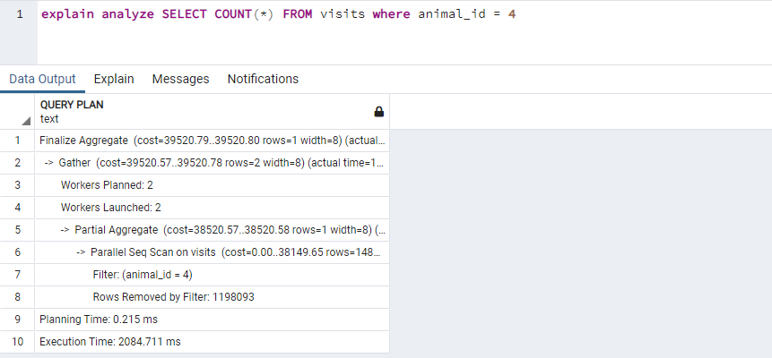
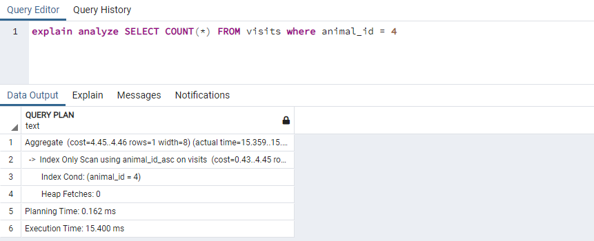
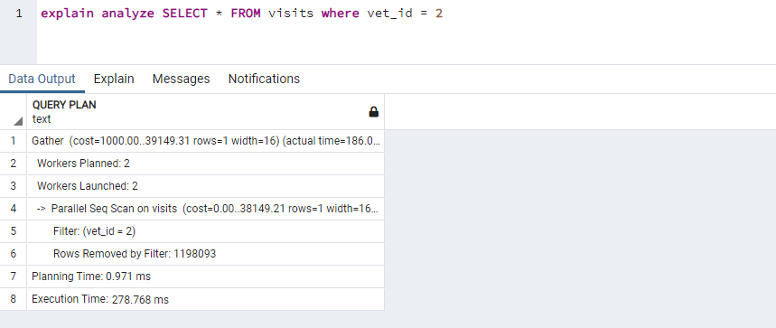
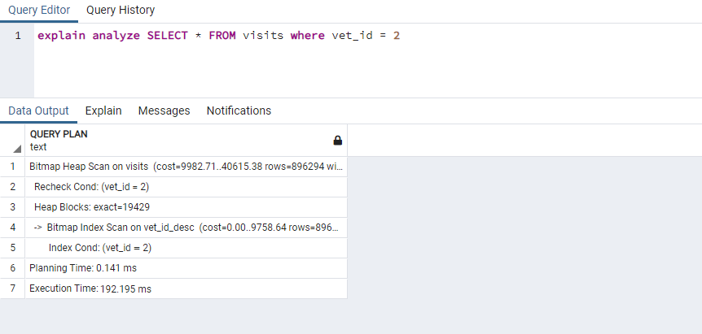
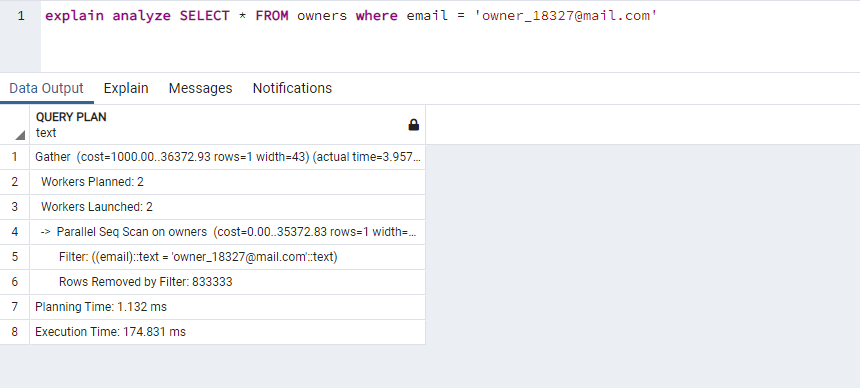
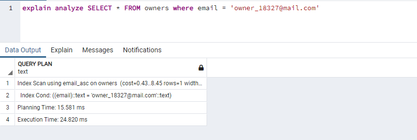

# JavaScript Capstone project

With this project we improve the performance for the database.

## Images for performance comparison

```SELECT COUNT(*) FROM visits where animal_id = 4```

> Before appliying performance


> After appliying performance


```SELECT * FROM visits where vet_id = 2```

> Before appliying performance


> After appliying performance


```SELECT * FROM owners where email = 'owner_18327@mail.com'```

> Before appliying performance


> After appliying performance


## Built With

- PostgreSQL
- VS Code

### Prerequisites

 - Postgres
 - PG Admin
 - Terminal

### Usage

 Clone the project by typing in your terminal `https://github.com/kensayo/vetClinicSQL.git`.

 - Change directory `cd` into the folder just created from the project.

 - Open postgreSQL
 - Create the database using the [`schema.sql`](./schema.sql) file
 - Add the email column inside the owners table by typing `ALTER TABLE owners ADD COLUMN email VARCHAR(120);`
 - Populate your database with the [`data.sql`](./data.sql) file
- To check the performance, run

    - `explain analyze SELECT COUNT(*) FROM visits where animal_id = 4;`

    - `explain analyze SELECT * FROM visits where vet_id = 2;`

    - `explain analyze SELECT * FROM owners where email = 'owner_18327@mail.com';`

## Author

👤 **Kenny Ortega**

- GitHub: [kensayo](https://github.com/kensayo)
- Twitter: [@kensayo](https://twitter.com/kensayo)
- LinkedIn: [LinkedIn](https://www.linkedin.com/in/kennyortega/)

## 🤝 Contributing

Contributions, issues, and feature requests are welcome!

Feel free to check the [issues page](../../issues/).

## Show your support

Give a ⭐️ if you like this project!

## Acknowledgments

To everyone in Microverse.

## 📝 License

This project is [MIT](./LICENSE) licensed.
